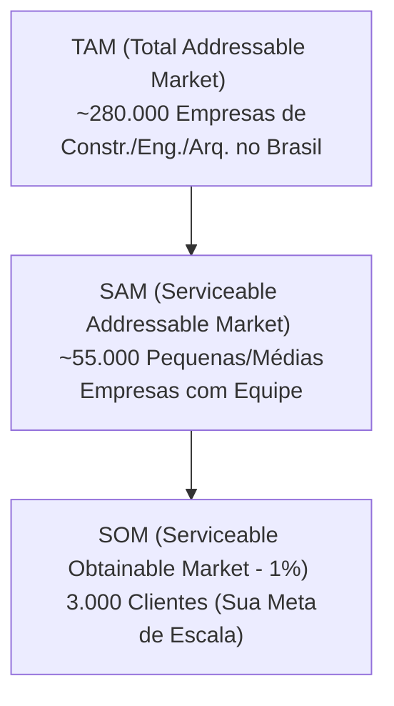

# 📊 Relatório de Composição de Custos Reais e Custo por Usuário (SaaS Elo 57)

Este relatório detalha os custos operacionais reais do **Elo 57**, extraídos diretamente dos lançamentos financeiros históricos da **Organização 2 (Studio 57)** para o ano de **2026**. O cálculo do **Custo Unitário por Usuário (CPU)** é baseado na equipe atual de **6 usuários ativos**.

> [!NOTE]
> Conforme alinhado com o Ranniere, os custos de IA (Gemini/Stella) foram desconsiderados nesta composição básica de infraestrutura, pois serão oferecidos e precificados separadamente como um plano ou add-on de IA (por consumo de tokens).

---

## 🔍 1. Extrato Detalhado Real de 2026 (Banco de Dados - Org 2)

Conectamos diretamente ao banco e listamos todos os lançamentos reais de **Netlify e Supabase** de janeiro a julho de 2026 com o status **"Pago"**. 

| ID Lançamento | Descrição no Financeiro | Vencimento / Pagamento | Valor (BRL) | Status |
| :--- | :--- | :--- | :--- | :--- |
| `#18188` | NETLIFY | 11/07/2026 | R$ -226,50 | Pago |
| `#18167` | SUPABASE | 07/07/2026 | R$ -180,17 | Pago |
| `#17873` | NETLIFY | 11/06/2026 | R$ -216,12 | Pago |
| `#17716` | SUPABASE | 07/06/2026 | R$ -174,00 | Pago |
| `#17382` | NETLIFY | 07/05/2026 | R$ -221,01 | Pago |
| `#17383` | SUPABASE | 07/05/2026 | R$ -175,80 | Pago |
| `#17104` | NETLIFY | 07/04/2026 | R$ -227,02 | Pago |
| `#17105` | SUPABASE | 07/04/2026 | R$ -36,94 | Pago |
| `#16240` | NETLIFY - ASSINATURA MENSAL - REF FEV26 | 07/03/2026 | R$ -228,08 | Pago |
| `#16246` | IOF OPERACAO EXTERIOR - NETLIFY | 07/03/2026 | R$ -7,98 | Pago |
| `#16235` | SUPABASE SINGAPORE US$ 25,00 - ASSINATURA REF FEV26 | 07/03/2026 | R$ -129,59 | Pago |

---

## 🛠️ 2. Composição de Custo Fixo de TI (Média Real de 2026)

*   **Netlify Real (Médio):** R$ 225,00 / mês
*   **Supabase Real (Médio):** R$ 176,66 / mês
*   **Renovação de Domínio (Diluída):** R$ 6,24 / mês
*   **Hostinger E-mails (Diluído):** R$ 29,97 / mês
*   💵 **Custo Fixo de TI Total:** **R$ 437,87 / mês**

---

## 👥 3. O Custo por Usuário Hoje (6 Usuários)

Dividindo o custo operacional real de TI (R$ 437,87/mês) pelos **6 usuários ativos** atuais (Raniere, Micaele, Amanda, Igor, Simone e Ludmila):

*   **Custo Fixo TI Real:** R$ 437,87 / mês
*   **Quantidade de Usuários:** 6
*   **Custo Unitário por Usuário (CPU):** **R$ 72,98 / usuário / mês**

---

## 🏢 4. Análise de Viabilidade Comercial (200 Organizações — Média 4 Usuários/Org)

Simulamos o cenário de escala do **SaaS Elo 57** considerando **200 organizações contratantes**, onde cada organização possui em média **4 usuários ativos** (1 usuário master incluso no plano + 3 usuários extras).

### A. Premissas de Faturamento e Custos
*   **Preço do Plano Pro por Organização:** R$ 497,00 / mês (inclui 1 usuário).
*   **Valor do Usuário Extra:** R$ 60,00 / user / mês.
*   **Total de Usuários Extras:** 200 orgs x 3 usuários extras = **600 usuários**.
*   **Total de Usuários Ativos no Sistema:** **800 usuários**.
*   **Impostos:** 6% sobre a nota fiscal emitida.
*   **Custo de TI Projetado (800 users com excedentes):** R$ 8.800,00 / mês (estimado a R$ 11,00 / usuário ativo devido à volumetria de requisições, banda e computação).
*   **Custo Operacional Fixo da Empresa (ADM):** R$ 20.000,00 / mês (suporte, CS, administrativo).

### B. Demonstrativo do Resultado Operacional (DRE Projetado Mensal)

| Item de Controle | Detalhamento Financeiro | Valor Mensal (BRL) |
| :--- | :--- | :--- |
| **Mensalidades das Orgs (Plano Pro)** | 200 organizações x R$ 497,00 | R$ 99.400,00 |
| **Usuários Extras (R$ 60/user)** | 600 usuários extras x R$ 60,00 | R$ 36.000,00 |
| **(=) RECEITA BRUTA TOTAL** | **Faturamento mensal consolidado** | **R$ 135.400,00** |
| **(-) Imposto (6%)** | Deduções fiscais sobre faturamento bruto | R$ -8.124,00 |
| **(=) Receita Líquida** | Receita real após impostos | **R$ 127.276,00** |
| **(-) Infraestrutura TI (800 users)** | Netlify Pro, Supabase Pro, Hostinger e overages | R$ -8.800,00 |
| **(-) Despesa ADM Fixa** | Custo de suporte, CS e escritório | R$ -20.000,00 |
| **(=) LUCRO LÍQUIDO MENSAL** | **Resultado financeiro líquido operacional** | **R$ 98.476,00** |

---

## 📈 5. Métricas e Composição do Custo Rateado

### A. Visão Unitária por Organização (200 Orgs / Média de R$ 677,00/mês)
*   **Faturamento Médio por Empresa:** **R$ 677,00 / org / mês**
*   **Custo de TI por Empresa (4 users):** **R$ 44,00 / org / mês**
*   **Custo de Imposto por Empresa (6%):** **R$ 40,62 / org / mês**
*   **Custo ADM Diluído por Empresa:** **R$ 100,00 / org / mês**
*   💵 **Custo Real Total por Empresa:** **R$ 184,62 / org / mês**
*   🎯 **Lucro Líquido Unitário por Empresa:** **R$ 492,38 / org / mês**

---

## 📊 6. Tabela de Sensibilidade do Ponto de Equilíbrio (Break-Even)

Caso a média de usuários extras por organização varie, a quantidade de clientes necessária para pagar o custo operacional fixo de **R$ 20.000,00/mês** (incluindo despesas e o seu pró-labore padrão) também se altera. 

Calculamos a margem de contribuição líquida por empresa e a meta de CNPJs ativos para cada cenário:

| Cenário (Média de Usuários) | Faturamento / Org | Imposto (6%) | Custo TI (R$ 11/user) | Margem Líquida / Org | Meta de Orgs (Break-Even)* |
| :--- | :--- | :--- | :--- | :--- | :--- |
| **1 Usuário** (Apenas Master) | R$ 497,00 | R$ 29,82 | R$ 11,00 | **R$ 456,18** | **44 Organizações** |
| **2 Usuários** (1 Extra) | R$ 557,00 | R$ 33,42 | R$ 22,00 | **R$ 501,58** | **40 Organizações** |
| **3 Usuários** (2 Extras) | R$ 617,00 | R$ 37,02 | R$ 33,00 | **R$ 546,98** | **37 Organizações** |
| **4 Usuários** (3 Extras) | R$ 677,00 | R$ 40,62 | R$ 44,00 | **R$ 592,38** | **34 Organizações** |

---

## 🚀 7. Projeção de Hiper-Escala (3.000 Organizações — 1% do Mercado Nacional)

Simulamos o cenário de expansão nacional do **Elo 57** atingindo **1% do mercado nacional de incorporadoras, engenheiros e arquitetos (3.000 organizações contratantes)**, com uma média de **4 usuários por organização** (12.000 usuários ativos no total).

### A. Premissas de Operação em Larga Escala
*   **Total de Faturamento Mensal:** R$ 2.031.000,00 / mês.
*   **Impostos (Lucro Presumido):** Carga tributária ajustada para **15%** (típica para faturamentos acima do teto do Simples Nacional).
*   **Custo de TI Otimizado:** R$ 10,00 / usuário ativo / mês (R$ 120.000,00 / mês para Supabase Enterprise, Netlify Enterprise e servidores de e-mail de alta performance).
*   **Estrutura de Equipe SaaS (ADM):** R$ 230.000,00 / mês (15 atendentes/CS, 5 desenvolvedores dedicados, marketing, contador, jurídico e pró-labore dos sócios de R$ 50.000,00).

### B. Demonstrativo do Resultado Operacional Mensal (3.000 Orgs / 12.000 Users)

| Item de Controle | Detalhamento Financeiro | Valor Mensal (BRL) |
| :--- | :--- | :--- |
| **Mensalidades das Orgs (Plano Pro)** | 3.000 organizações x R$ 497,00 | R$ 1.491.000,00 |
| **Usuários Extras (R$ 60/user)** | 9.000 usuários extras x R$ 60,00 | R$ 540.000,00 |
| **(=) RECEITA BRUTA TOTAL** | **Faturamento mensal consolidado** | **R$ 2.031.000,00** |
| **(-) Imposto (15% - Lucro Presumido)**| Carga tributária consolidada federal e municipal | R$ -304.650,00 |
| **(=) Receita Líquida** | Receita real após impostos | **R$ 1.726.350,00** |
| **(-) Infraestrutura TI (12.000 users)**| Supabase Enterprise + Netlify Enterprise + APIs | R$ -120.000,00 |
| **(-) Despesa Operacional / Pessoal** | Equipe de Suporte, CS, Devs, Vendas e Pró-labore | R$ -230.000,00 |
| **(=) LUCRO LÍQUIDO MENSAL** | **Lucro líquido operacional mensal** | **R$ 1.376.350,00** |

---

## 📈 8. Dimensionamento do Mercado Potencial no Brasil (TAM / SAM / SOM)

Para avaliar o quão realistas são as metas de **1.000** e **3.000** clientes (organizações), pesquisamos a volumetria oficial do setor no Brasil através das bases da Receita Federal e conselhos profissionais (CAU/CREA):

### A. TAM (Total Addressable Market - Mercado Total Endereçável)
*   **Empresas de Construção Civil (CNAE 4120-4 e 4110-7):** Estima-se que existam mais de **60.000 a 80.000 empresas ativas** (incorporadoras e construtoras de edifícios).
*   **Escritórios de Projetos (CNAEs 7111-1 e 7112-0):** O CAU-BR possui cerca de **47.303 empresas de arquitetura** registradas ativas. Os serviços de engenharia possuem **156.957 empresas** ativas no país.
*   **Mercado Total Potencial:** **~280.000 empresas de projeto e execução**.
*   *Nota:* O seu cálculo original sugerindo 300.000 clientes potenciais está **perfeitamente alinhado com a realidade dos dados estatísticos federais!**

### B. SAM (Serviceable Addressable Market - Mercado Endereçável Útil)
Nem toda empresa do TAM precisa de um software completo. Excluímos profissionais autônomos puros (PJ de um homem só que atua apenas com laudos) e grandes corporações de capital aberto (como Cyrela/MRV que usam SAP/Totvs).
*   Focamos em construtoras de médio/pequeno porte e escritórios de engenharia estruturados (de 3 a 50 funcionários).
*   Estima-se que cerca de **20% do mercado** tenha esse perfil: **~55.000 organizações úteis**.

### C. SOM (Serviceable Obtainable Market - Mercado Capturável / Metas)
*   **1.000 Organizações (Meta de Médio Prazo):** Representa apenas **0,35% do TAM** ou **1,8% do SAM**. É uma meta de penetração de mercado perfeitamente factível em 2 anos de operação comercial focada.
*   **3.000 Organizações (Meta de Hiper-Escala):** Representa apenas **1% do TAM** ou **5,4% do SAM**. Atingir esse patamar é totalmente plausível em 3 a 5 anos de crescimento sustentado, consolidando a empresa no mercado nacional.
